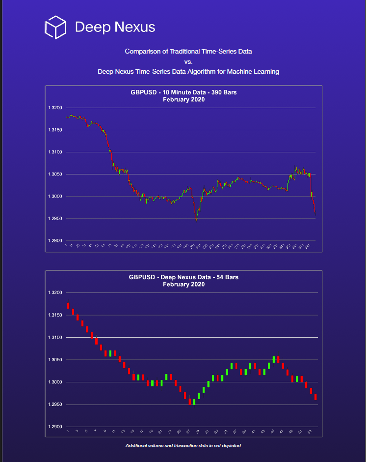

# Deep Nexus One (DN1) Research Repository: Percent Change-Based Bar Formation

## Project Overview

This repository introduces a method for creating **time-invariant bars** from tick data to create price sequences that are optimal for sequence-to-sequence prediction models (such as LSTM). By aggregating data based on changes in price rather than time, the model is suppplied with a more equal density of information.

### Key Features
- **Percent Change-Based Bars**: Group tick data by change in price to highlight high-activity periods via the compression algorithm.
- **Transaction Data**: Group tick transaction and volume data for each time-invarient bar for additional model features.
- **Speed**: Use numba with jit decorators to parallelize and speed up processing.
- **Flexible Applications**: Designed for algorithmic trading, backtesting, and real-time inference.

## Comparison of Time-Based vs. Change-Based Bars

Time-based bars aggregate data into equal intervals (e.g., 10 minutes), regardless of trading activity. In contrast, change-based bars group data by trading activity, forming a new bar only when a specified percent change threshold is met. This ensures low activity periods are not over-weighted.



*Figure: Time-based bars (top) vs. change-based bars (bottom).*


## Getting Started
1. Clone the repository.
2. Install dependencies:
   ```bash
   pip install -r requirements.txt
3. Import your own tick data in .csv or .h5 (or whatever your preference) format.
4. Run create_bars_v3_numba.py to generate percent change-based bars.


## Limitations and Considerations
- Research project from 2020.
- Python 3.5 was used to build this project.
- Numba and jit decorators may have compatability issues with some systems.
- Tick data files tend to be enormous. Prepare accordingly.
- Developed for specific trading strategy and currency pairs.
- Requires careful review and potential updates for current market conditions.

## Disclaimer
This is a research project and should not be considered financial advice. Trading involves significant financial risk.

## License
http://www.apache.org/licenses/LICENSE-2.0

## Contact
web@deepnexus.com

_Repository initialized in 2024, based on research conducted in 2020._
